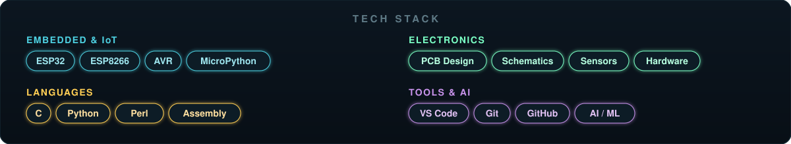

# ZeRo-RX

  

  <b>Electronics &nbsp;•&nbsp; Embedded Systems &nbsp;•&nbsp; IoT &nbsp;•&nbsp; Python &nbsp;•&nbsp; AI</b>

---

  

## About Me

I'm an **electronics and embedded systems developer** working at the intersection of hardware and software. My day-to-day revolves around microcontrollers, circuits, and the code that brings them to life — from low-level C on AVR/ESP chips to Python tooling, automation, and ML.

I build things with **ESP32 / ESP8266**, **MicroPython**, **C**, and **Python**, and I care about clean, working hardware as much as clean code.

## Tech Stack

  

## What I Work With

| Domain | Highlights |
|--------|------------|
| **Embedded & IoT** | ESP32, ESP8266, AVR, MicroPython, sensor interfacing |
| **Electronics** | PCB design, schematics, breadboard prototyping, hardware bring-up |
| **Software** | Python, C, networking, REST APIs, automation, data & ML |
| **Tooling** | VS Code, Git, GitHub, Espressif toolchain |

## Featured Projects

| Project | Language | Description |
|---------|----------|-------------|
| [esp32-project](https://github.com/ZeRo-RX/esp32-project) | Python | ESP32 development projects (MicroPython / Python) |
| [IOT](https://github.com/ZeRo-RX/IOT) | C++ | Internet-of-Things firmware and examples |
| [DHT_11](https://github.com/ZeRo-RX/DHT_11) | Perl | DHT11 temperature/humidity sensor schematic |
| [Follow-the-line-robot](https://github.com/ZeRo-RX/Follow-the-line-robot) | Assembly | Line-following robot helper code and technical view |
| [btc_data](https://github.com/ZeRo-RX/btc_data) | Python | Bitcoin data collection / analysis |
| [crud_api](https://github.com/ZeRo-RX/crud_api) | Python | CRUD REST API |

## GitHub Statistics

  

## Current Focus

- Building reliable **ESP32 / MicroPython** firmware for sensors and automation
- Designing and prototyping **PCBs** for embedded projects
- Combining **Python tooling** with hardware for data capture and control
- Exploring **AI/ML** applied to embedded and IoT workflows

## Contact

- **GitHub:** [@ZeRo-RX](https://github.com/ZeRo-RX)

---

  

